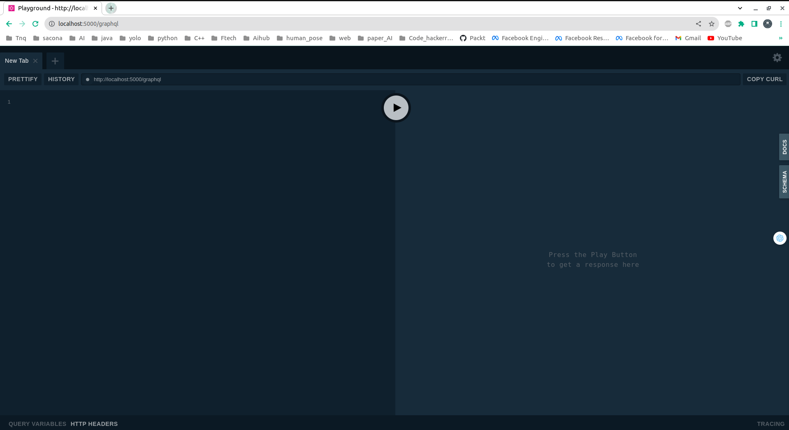
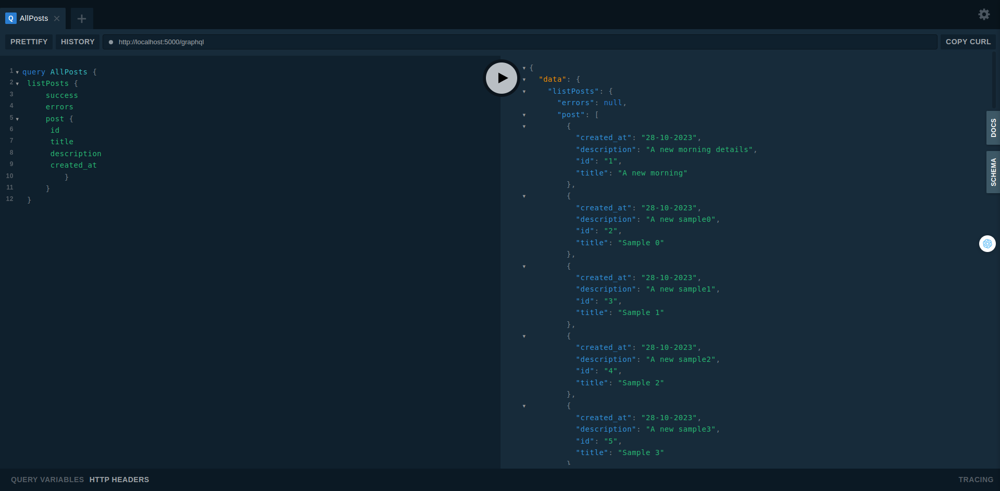
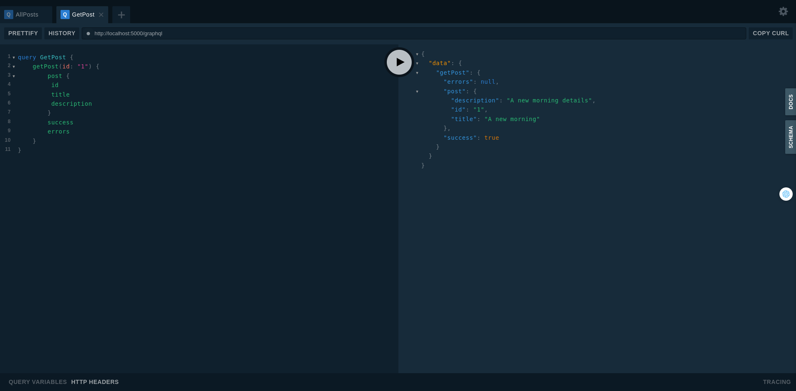
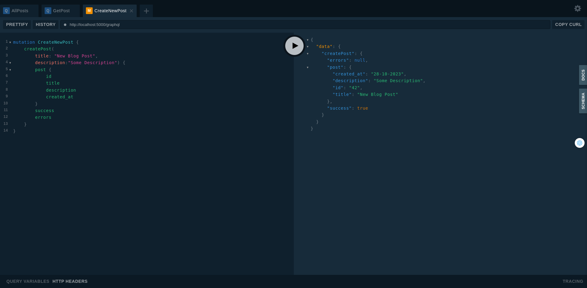
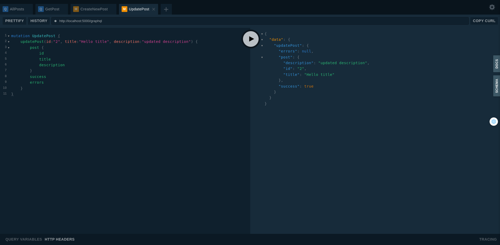
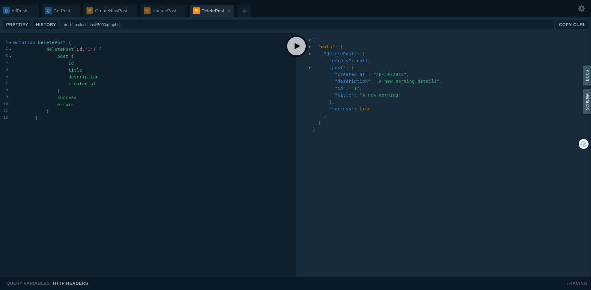

# graphql-flask-python-api
graphql tutorial with python example


## Learning objectives
- Set up a Python web server with Flask
- Use the Ariadne library to implement GraphQL
- Compose a GraphQL Schema 
- Perform queries and mutations against a Python GraphQL API
  
```GraphQL vs REST: What problem does GraphQL solve?  If you are completely new to GraphQL and want to know how it differs from a traditional REST API, I recommend reading “What is GraphQL? GraphQL introduction“.```

## Development

### Prerequisite

| Name | Version |
| --- | --- |
| Python | 3.8 |
| conda  | 23.1.0|
### Environment setup
1. Initialize environment variable
   ```
    conda create -n graphql-flask-api-env python=3.8
    conda activate graphql-flask-api-env
    ```
2. Initialize Python environment
   ```
   pip install -r requirements.txt
   ```
3. Start development API service
   ```
   export FLASK_APP=app.py
   flask run --host 0.0.0.0 --port 5000
    ```
4. Start sever SQLAlchemy
   ```
   docker compose up postgres
   ```
5. Initial data test
   ```
   python script/
   ```
6. Check localhost endpoint
    ```
    http://localhost:5000/graphql
    ```
    screen interface
    

### Test graphql
#### A. Query
   1. Query all posts 

      ```
      query AllPosts {
       listPosts {
           success
           errors
           post {
            id
            title 
            description
            created_at
               }
           }
       }
      ```
      Screen
      

   2. Querying a single post by id
       
       ```
       query GetPost {
           getPost(id: "1") {
               post {
                id
                title
                description
               }
               success
               errors
           }
       }
       ```
       Screen
      
#### B. Mutation

   1. Creating a new post 
        ```
        mutation CreateNewPost {
            createPost(
                title: "New Blog Post", 
                description:"Some Description") {
                post {
                    id
                    title
                    description
                    created_at
                }
                success
                errors
            }
        }
        ```
        Screen
        
   2. Updating a post
        ```
        mutation UpdatePost {
            updatePost(id:"2", title:"Hello title", description:"updated description") {
                post {
                    id
                    title
                    description
                }
                success
                errors
            }
        }
        ```
        Screen
        
   3. Deleting a post
        ```
        mutation DeletePost {
            deletePost(
                title: "New Blog Post", 
                description:"Some Description") {
                post {
                    id
                    title
                    description
                    created_at
                }
                success
                errors
            }
        }
        ```
        Screen
        
## Deployment

### Prerequisite

| Name | Version |
| --- | --- |
| Docker | 19.03.6 |
| docker-compose | 1.17.1 |

### Building image

```
make service_build
```
This will build the image with tag `flask-grapql:latest`

### Deployment step

The service is deployed with `docker-compose`.

1. Start system
```
make service_up
```
2. Stop system
```
make service_down
```